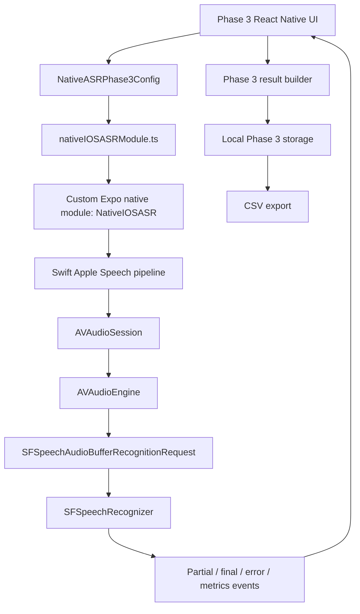
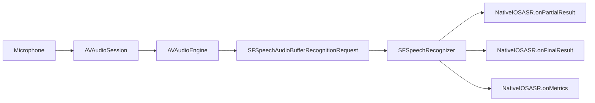
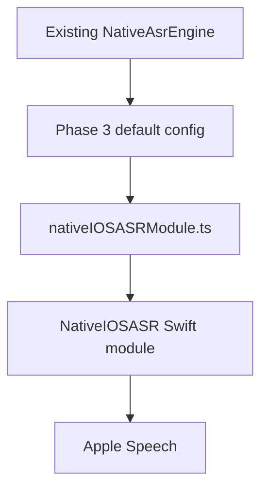

# Phase 3 Native iOS ASR Configuration

## 1. Phase 3 Goal

Phase 3 makes the selected Native iOS ASR path configurable, observable, and measurable for the thesis prototype. The goal is not to build the full construction-report autofill flow yet. This phase focuses only on improving how the app configures and evaluates Native iOS ASR.

Phase 3 does not fine-tune Apple's ASR model.

Phase 3 improves how the app configures and evaluates Native iOS ASR.

The app preserves the raw Native ASR transcript.

The prototype relies on the native iOS Speech/audio stack and does not implement a custom noise-removal algorithm.

Offline behavior is only claimed when on-device recognition is supported and explicitly required.

## 2. Why Native iOS ASR Was Selected

The Phase 2 manual ASR pilot on iPhone 11 Pro showed that Native iOS ASR gives the best current fit for the iOS reporting workflow because it supports live transcription, fast feedback, and a low-friction mobile interaction pattern.

Whisper, Qwen, and Parakeet remain useful comparison paths, but Phase 3 advances the selected Native iOS path first because the long-term prototype flow depends on fast voice input during mobile construction reporting:

```text
voice input
-> selected ASR
-> transcript improvement
-> context extraction
-> autofilled construction report preview
-> user edits/confirms
```

Phase 3 only addresses the selected ASR part of this flow.

## 3. Why a Custom Expo Native Module Is Used

The prototype uses a custom iOS Expo native module because React Native alone cannot configure `SFSpeechAudioBufferRecognitionRequest`.

The previous Native ASR implementation used a higher-level speech-recognition package. That was useful for early exploration, but it did not expose the native Apple Speech request configuration needed for Phase 3, such as:

- `requiresOnDeviceRecognition`
- `contextualStrings`
- `addsPunctuation`
- `taskHint`
- request-level partial result behavior
- capability and audio-session metadata logging

Plain Expo Go cannot run this Phase 3 native module. The app must be run with a custom Expo development build, `expo run:ios`, or Xcode after native module autolinking and CocoaPods installation.

## 4. High-Level Architecture

Phase 3 splits responsibility between React Native and native Swift:



The important design decision is that React Native owns the experiment configuration and thesis data model, while Swift owns the Apple Speech implementation.

## 5. Implemented Files

Native module:

- `modules/native-ios-asr/expo-module.config.json`
- `modules/native-ios-asr/package.json`
- `modules/native-ios-asr/ios/NativeIOSASR.podspec`
- `modules/native-ios-asr/ios/NativeIOSASRModule.swift`

React Native Phase 3 layer:

- `src/features/asr/phase3/nativeASRPhase3.types.ts`
- `src/features/asr/phase3/nativeIOSASRModule.ts`
- `src/features/asr/phase3/projectSpeechContext.ts`
- `src/features/asr/phase3/contextualStringsBuilder.ts`
- `src/features/asr/phase3/transcriptPreparation.ts`
- `src/features/asr/phase3/continuousTranscriptAccumulator.ts`
- `src/features/asr/phase3/phase3NativeASRResultBuilder.ts`
- `src/features/asr/phase3/phase3NativeASRStorage.ts`

UI and integration:

- `app/(tabs)/phase3-native-asr.tsx`
- `app/(tabs)/_layout.tsx`
- `src/features/asr/engines/nativeAsrEngine.ts`
- `package.json`

Documentation:

- `docs/phase-3-native-ios-asr-config.md`

## 6. Native iOS Speech Pipeline

The native Swift module uses the normal iOS live speech recognition pipeline:



The native side configures:

- `SFSpeechRecognizer(locale: Locale(identifier: config.locale))`
- `SFSpeechAudioBufferRecognitionRequest()`
- `request.shouldReportPartialResults = true`
- `request.taskHint = .dictation`
- safe on-device recognition policy
- optional `request.contextualStrings`
- optional `request.addsPunctuation` when supported by the iOS version

The audio session is intentionally simple and stable:

```text
AVAudioSession category: record
AVAudioSession mode: default
```

Phase 3 does not introduce audio-session experiments, voice chat modes, AGC toggles, echo-cancellation experiments, custom preprocessing, or custom noise suppression.

## 7. Native Module Public API

The custom Expo module is named `NativeIOSASR`.

It exposes these methods to React Native:

- `requestPermissions()`
- `getCapabilities(locale)`
- `startRecognition(config)`
- `stopRecognition()`
- `cancelRecognition()`

It emits these events:

- `NativeIOSASR.onState`
- `NativeIOSASR.onPartialResult`
- `NativeIOSASR.onFinalResult`
- `NativeIOSASR.onError`
- `NativeIOSASR.onMetrics`

This event design lets the UI show live transcription while also preserving final text and configuration metadata for analysis.

## 8. React Native Responsibilities

React Native owns the Phase 3 experiment layer:

- selected language and locale
- selected Phase 2 test case and test session
- on-device recognition policy
- contextual strings toggle and contextual string builder
- punctuation toggle
- live partial transcript display
- final raw transcript display
- normalized transcript generation
- WER/CER calculation when reference text exists
- Phase 3 result object creation
- local result saving
- CSV export

The default config is conservative:

```ts
{
  configId: "native_ios_phase3_default_v1",
  locale: "en-US",
  language: "en",
  shouldReportPartialResults: true,
  taskHint: "dictation",
  onDevicePolicy: "prefer",
  contextualStringsEnabled: false,
  contextualStrings: [],
  addsPunctuation: false,
  transcriptPreparation: {
    enabled: true,
    normalizeForScoring: true,
    correctionRulesEnabled: false
  }
}
```

## 9. How Phase 3 Is Applied to the Existing Native ASR Path

The existing Native ASR engine was kept compatible with the existing Phase 1/2 controller contract, but its implementation now routes through the new custom native module.

Before Phase 3, Native ASR depended on a higher-level speech-recognition abstraction. After Phase 3:



This means the existing Native ASR path now benefits from:

- selected locale handling
- partial result events
- dictation task hint
- safer on-device recognition policy
- native capability detection
- improved stop/final handling
- pause-aware transcript accumulation

On Android or unsupported environments, the engine returns a clear unsupported/native-build-required error instead of affecting Whisper, Qwen, or Parakeet.

## 10. Locale Handling

The UI maps language to locale:

- English -> `en-US`
- Finnish -> `fi-FI`

React Native sends the selected locale to Swift. Swift applies it when creating the recognizer:

```swift
SFSpeechRecognizer(locale: Locale(identifier: config.locale))
```

This is important because recognizer availability, punctuation support, and on-device recognition support can vary by device, locale, and iOS version.

## 11. Partial, Final, and Normalized Transcripts

Phase 3 intentionally keeps multiple transcript forms because they serve different thesis-analysis purposes.

`livePartialTranscript` is the live text shown while the user is still speaking. It gives immediate feedback and is used to measure time to first speech text.

`rawTranscript` is the final Native iOS ASR output. It is preserved as evidence of what Apple Speech actually produced.

`normalizedTranscript` is derived from the raw transcript for WER/CER scoring. It lowercases text, trims whitespace, collapses repeated spacing, and removes basic punctuation.

`improvedTranscript` currently equals the raw transcript by default. It exists as a scaffold for later correction-rule experiments, but Phase 3 does not add aggressive correction rules.

## 12. Pause-Aware Transcript Accumulation

During manual testing, Apple Speech could emit a new partial phrase after a pause, which made the UI appear to replace text spoken before the pause. Phase 3 now includes a transcript accumulator.

The accumulator treats each incoming recognizer result as either:

- a revision of the current active phrase, or
- a new phrase after a pause that should be appended to the committed transcript

Example:

```text
User says: There is a water leak in bathroom A302.
User pauses.
User says: The plumbing contractor should inspect it today.

Accumulated transcript:
There is a water leak in bathroom A302. The plumbing contractor should inspect it today.
```

This behavior is implemented in both the React Native Phase 3 layer and the native Swift module so the Phase 3 tab and the existing `NativeAsrEngine` path keep the full session text until the user presses Stop.

## 13. On-Device Recognition Policy

Phase 3 supports three policies:

- `prefer`: require on-device recognition only when `supportsOnDeviceRecognition` is true; otherwise allow fallback.
- `require`: fail safely before recognition when on-device recognition is unsupported.
- `allowNetwork`: do not set `requiresOnDeviceRecognition`.

The native module never blindly forces on-device recognition. It checks `recognizer.supportsOnDeviceRecognition` first.

Each result logs:

- `onDevicePolicy`
- `supportsOnDeviceRecognition`
- `requestedRequiresOnDeviceRecognition`
- `recognitionPrivacyMode`

The privacy modes are:

- `on_device_required`
- `on_device_preferred`
- `network_allowed`
- `network_allowed_fallback`
- `unsupported_required_failed`

This supports privacy-first thesis claims without overstating offline behavior.

## 14. Contextual Strings

Contextual strings are implemented as a configurable scaffold. They are disabled by default.

Apple's [`SFSpeechRecognitionRequest.contextualStrings`](https://developer.apple.com/documentation/speech/sfspeechrecognitionrequest/contextualstrings) documentation recommends short custom phrases and limits the total number of phrases to no more than 100. Phase 3 therefore uses a safer prototype cap of 90 phrases total, split into 45 English phrases and 45 Finnish phrases.

The current contextual string set is defined in `src/features/asr/phase3/projectSpeechContext.ts`:

- `EN_CONSTRUCTION_CONTEXTUAL_STRINGS_V1`: 45 English construction-reporting phrases
- `FI_CONSTRUCTION_CONTEXTUAL_STRINGS_V1`: 45 Finnish construction-reporting phrases
- `MAX_CONTEXTUAL_STRINGS_TOTAL`: 90
- `MAX_CONTEXTUAL_STRINGS_PER_LANGUAGE`: 45

React Native builds the contextual string list from construction-specific terms such as:

- issue types
- contractor roles
- inspection/reporting concepts
- locations and building areas
- defect descriptions
- building systems
- safety terms
- urgency words
- Finnish terms

The selected English terms prioritize phrases likely to appear in spoken construction reports:

```text
water leak
plumbing contractor
electrical fault
moisture damage
fall protection
site inspection
corrective action
```

The selected Finnish terms prioritize equivalent construction-site vocabulary:

```text
vesivuoto
kylpyhuone
putkiurakoitsija
sähköurakoitsija
turvakaide
putoamissuojaus
kosteusvaurio
```

When contextual strings are enabled and the list is non-empty, Swift applies:

```swift
request.contextualStrings = config.contextualStrings
```

Contextual strings and punctuation are implemented as configurable features, but the actual vocabulary will be tuned after the first implementation.

Contextual strings do not fine-tune Apple ASR. They only provide recognition hints that may help with construction vocabulary, contractor roles, safety terms, and Finnish construction words.

The UI shows only `contextualStringsCount`; it does not expose a large vocabulary editor yet.

## 15. Punctuation

Punctuation is implemented as a configurable scaffold. It is disabled by default.

React Native sends:

```ts
addsPunctuation: boolean
```

Swift applies punctuation only when the iOS API is available:

```swift
if #available(iOS 16.0, *) {
  request.addsPunctuation = config.addsPunctuation
}
```

Each result logs:

- `addsPunctuation`
- `addsPunctuationApplied`

Punctuation may improve readability even when WER/CER does not change much, because normalized scoring removes basic punctuation.

## 16. Capability Detection

The native module exposes `getCapabilities(locale)`. It returns:

- platform
- requested locale
- recognizer availability
- on-device recognition support
- OS version
- device model
- current audio session category
- current audio session mode
- sample rate
- partial-results support

This lets the app record what the device actually supported at test time.

## 17. Permissions and Error Handling

The module requests and checks:

- microphone permission
- speech recognition permission

If either permission is missing, recognition does not start and the UI receives a clear error.

The implementation handles:

- recognizer unavailable
- unsupported locale
- speech recognition permission denied
- microphone permission denied
- audio engine start failure
- recognition request failure
- on-device recognition required but unsupported
- recognition task cancellation
- no final result returned

Failed attempts can still be saved as Phase 3 results when relevant metadata is available.

## 18. Metrics and Observability

Phase 3 captures these timing points:

- recording start time
- first partial result time
- final result time
- recognition stop time

Derived metrics include:

- `ttfsMs`
- `finalLatencyMs`
- `transcriptionTimeMs`
- `recordingDurationMs`
- `realTimeFactor`

The implementation also logs:

- locale and language
- config ID
- contextual strings enabled/count
- punctuation enabled/applied
- on-device policy and privacy mode
- recognizer availability
- audio session category/mode/sample rate
- success or error message

These fields make Phase 3 suitable for thesis analysis even when accuracy improvements are modest.

## 19. Phase 3 Result Schema

Phase 3 results are stored separately from Phase 2 and include:

- result ID and timestamp
- Phase 2 test case/session identifiers
- model identity: `native_ios`, `Native iOS ASR`, `native`
- locale/language/config ID
- raw, final, normalized, and improved transcript fields
- reference text and normalized reference text
- WER/CER when reference text exists
- partial transcript count and optional partial transcript list
- task hint
- contextual string metadata
- punctuation metadata
- on-device privacy metadata
- recognizer/capability metadata
- recording and latency metrics
- audio session metadata
- success/error fields
- notes

## 20. Storage and CSV Export

Phase 3 stores results locally using a dedicated storage service.

The Phase 3 tab exports CSV to:

```text
<documentDirectory>/phase3-native-ios-asr/native-asr-results-export.csv
```

CSV export uses the requested Phase 3 field order, including:

- transcript fields
- scoring fields
- contextual strings fields
- punctuation fields
- on-device policy fields
- capability fields
- timing fields
- success/error fields

This makes the exported data suitable for comparison tables in the thesis report.

## 21. How to Run Phase 3 Tests

1. Build and run a custom iOS dev client with the native module included.
2. Open the `Phase 3` tab.
3. Select English or Finnish.
4. Select a Phase 2 test case and session.
5. Choose `prefer`, `require`, or `allowNetwork`.
6. Optionally enable contextual strings.
7. Optionally enable punctuation.
8. Start recognition and speak the reference report.
9. Pause and continue speaking if testing continuation behavior.
10. Stop recognition.
11. Review live partial text, final raw transcript, normalized transcript, WER/CER, TTFS, latency, and privacy metadata.
12. Save the Phase 3 result.
13. Export CSV when enough runs have been collected.

## 22. Recommended Phase 3 Test Matrix

To test contextual strings and punctuation, use the same sentence, same room, same speaking distance, and same speaking style while changing only one setting:

| Test | Contextual strings | Punctuation | Purpose |
|---|---:|---:|---|
| A | off | off | Baseline |
| B | on | off | Contextual strings effect |
| C | off | on | Punctuation effect |
| D | on | on | Combined effect |

Useful English phrase:

```text
There is a water leak in the bathroom near the staircase. The plumbing contractor should inspect it urgently.
```

Useful Finnish phrase:

```text
Kylpyhuoneessa on vesivuoto. Turvakaide pitää tarkistaa kiireellisesti.
```

For contextual strings, compare recognition of terms such as `water leak`, `plumbing contractor`, `moisture damage`, `fall protection`, `vesivuoto`, `kylpyhuone`, `putkiurakoitsija`, and `turvakaide`.

For punctuation, compare the final raw transcript readability. WER/CER may not change because normalized scoring removes punctuation.

## 23. Known Limitations

- iOS is implemented first; Android is intentionally unsupported for Phase 3 Native iOS ASR.
- The module requires a custom Expo development build and does not work in plain Expo Go.
- Apple Speech availability, on-device support, and punctuation behavior vary by device, locale, and iOS version.
- Contextual strings are a scaffold, not a tuned construction vocabulary.
- Punctuation affects readability more than normalized WER/CER.
- The app does not claim fully offline recognition unless on-device recognition is supported and `requiresOnDeviceRecognition` was actually set.
- Phase 3 does not implement context extraction or construction-report form autofill.
- Phase 3 does not implement custom noise removal or audio enhancement.
- Real transcription improvement may be modest because the core recognizer is still Apple's model.

## 24. Next Step

The next step is to run a controlled contextual-strings and punctuation test matrix, then tune the contextual string list using observed errors from saved Phase 3 CSV results.

After that, the prototype can move toward transcript improvement, context extraction, and construction report preview generation.
