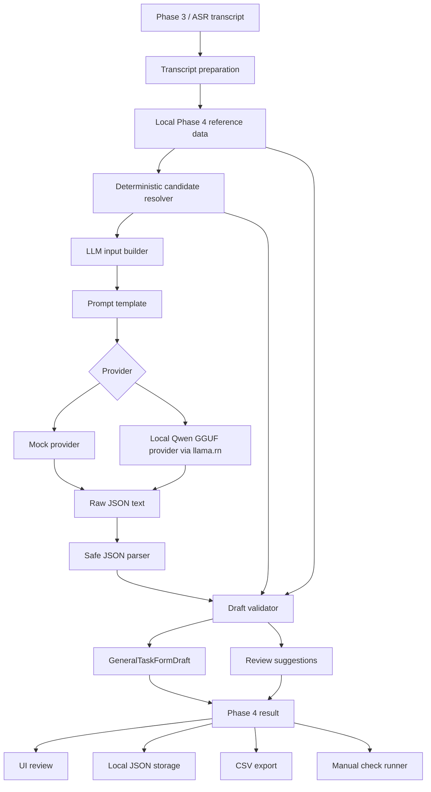
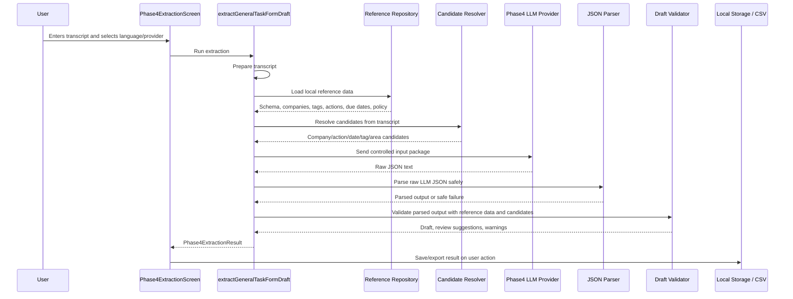
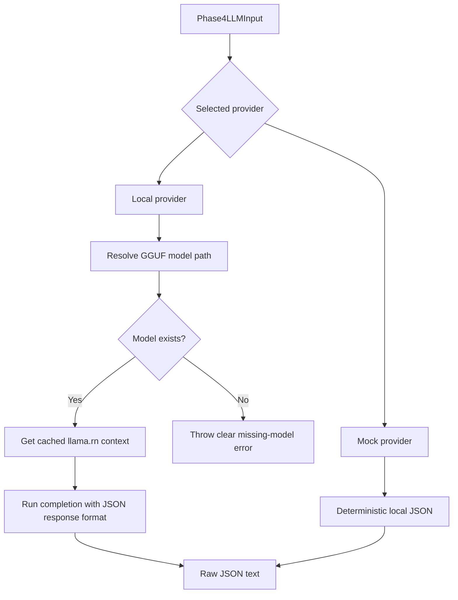

# Phase 4 Complete Technical Report

Last updated: 2026-05-22, Europe/Helsinki.

## 1. Executive Summary

Phase 4 implements a local, data-grounded extraction pipeline that converts an ASR transcript into a Congrid-style General Task Form draft. It is not a chatbot and it does not submit tasks automatically. It creates a partial draft and review suggestions so the user can confirm, edit, or reject extracted values in the next form flow.

The current implementation uses a hybrid architecture:

- deterministic transcript preparation and candidate retrieval
- local LLM structured extraction
- safe JSON parsing
- deterministic validation against local reference data
- final draft fields plus review-only suggestions
- local result storage and CSV export
- Phase 4 debug UI and manual check runner

The LLM is used as a controlled extraction engine. The validator remains the safety authority. This means the LLM can suggest and preserve useful intent, but it cannot write unsafe or unsupported values directly into final form fields.

## 2. Architecture Overview



The important architectural principle is:

```text
The LLM suggests. The validator decides. The user confirms.
```

## 3. End-To-End Flow



## 4. Data Sources

Phase 4 v1 uses local TypeScript reference data only. It does not use Supabase, SQLite, remote storage, remote retrieval, GPS, cloud LLMs, OpenAI API calls, or automatic task submission.

Local reference data includes:

- General Task Form schema
- allowed companies
- allowed tags
- allowed required actions
- allowed due dates
- allowed area options
- extraction policy
- company responsibility summaries
- company work intents

The main reference repository function is `getPhase4ReferenceData()`, which bundles all Phase 4 datasets for the extraction pipeline.

## 5. General Task Form Scope

Phase 4 currently targets one form:

```text
General Task Form
schemaVersion: v1
default list: Hallo
```

Field handling:

| Field | Phase 4 behavior |
| --- | --- |
| list | Always defaults to `Hallo` |
| company | Suggested only from local allowed companies |
| description | Extracted from transcript or LLM output, fallback to transcript |
| area | Filled only when spoken and allowed or candidate-derived |
| marker | Manual only |
| photos | Skipped |
| requiredAction | Suggested only from allowed actions |
| requiredActionDueDate | Final value only `Now`, `+3 days`, `+7 days`, or null |
| tags | Allowed tags only |
| impacts | Not configured |
| notifications | Always false |

## 6. AI Technique And Terminology

The implemented technique is:

```text
grounded local LLM structured extraction with deterministic validation
```

More specifically:

- **Local rule-based candidate retrieval**: deterministic TypeScript matching over local reference data.
- **Grounded semantic suggestion**: the LLM receives local allowed values, candidates, responsibility summaries, and work intents.
- **Structured extraction**: the LLM is prompted to return JSON only.
- **Deterministic validation**: TypeScript validates every final field against allowed local data.
- **Review suggestion preservation**: unsupported but useful user intent is preserved for the user flow.

Not implemented in Phase 4 v1:

- embeddings
- vector indexing
- semantic vector search
- reranking model
- translation model
- cloud LLM
- remote retrieval
- local database

Embeddings or vector indexing may become useful later if the local company/project reference data becomes too large for simple local matching and compact prompt grounding.

## 7. Candidate Resolver

The candidate resolver is deterministic. It normalizes the transcript and searches local reference data for known words, phrases, responsibility summaries, and work intents.

It produces:

- company candidates
- area candidates
- required action candidates
- due date candidates
- tag candidates

Company candidates are ranked by matching:

- English and Finnish service keywords
- role labels
- work intents
- responsibility summaries
- default-company category boost

Example:

```text
"There is a need of gas connection tomorrow."
```

can produce a plumbing company candidate because the local company data grounds gas connection as a pipe/plumbing responsibility. The final due date remains manual because `tomorrow` is not an allowed final due-date option, but `tomorrow` is preserved in review suggestions.

## 8. LLM Input Package

The LLM input is built from:

- transcript
- language (`en` or `fi`)
- General Task Form schema
- allowed companies
- allowed tags
- allowed required actions
- allowed due dates
- extraction policy
- deterministic candidate resolution

The prompt asks the model to use only allowed values for final fields and to preserve useful unsupported intent in `reviewSuggestions`.

The allowed company payload is compacted before prompting. When company candidates exist, the prompt sends only candidate companies instead of the full company database. This reduces context pressure and keeps the model grounded in likely local choices.

## 9. LLM Provider Architecture



### Mock Provider

The mock provider is deterministic and local-only. It is used for:

- manual checks
- UI smoke testing
- development without requiring local GGUF inference

### Local Provider

The local provider uses:

- `llama.rn`
- a llama.cpp-compatible GGUF model
- Qwen2.5-1.5B-Instruct Q4_K_M
- local app document storage for the model file

The expected model file path is:

```text
<documentDirectory>/models/llm/qwen2_5_1_5b_instruct_q4_k_m/qwen2.5-1.5b-instruct-q4_k_m.gguf
```

The model file is not committed to Git. The `.gitignore` rule excludes:

```text
models/llm/**/*.gguf
```

The UI can check model readiness and download the configured GGUF file. After the file exists on device, inference remains local.

### Context Loading And Reuse

The local provider caches the `LlamaContext` in memory:

```text
first local extraction -> initLlama loads/initializes model context
later extraction in same app/runtime -> cached context is reused
```

The provider calls `clearCache(false)` before completion to clear the previous session state without releasing the loaded model context. An explicit release function exists, but normal extraction does not call it.

Current local runtime settings are intentionally unchanged for baseline testing:

```text
n_ctx: 4096
n_gpu_layers: 99
n_predict: 700
temperature: 0
top_p: 1
response_format: json_object
```

## 10. JSON Output Shape

The LLM returns a JSON object with:

- `formId`
- `schemaVersion`
- `fields`
- `reviewSuggestions`
- `warnings`

`fields` contains draft-oriented values such as company, description, area, action, due date, tags, and default/manual/skipped fields.

`reviewSuggestions` contains useful information that should not necessarily be written into the strict final form:

- work intent
- spoken unsupported due date text
- unsupported due date reason
- spoken company text
- suggested company IDs
- manual review reasons

This separation is important. It prevents the validator from deleting useful LLM output while still keeping final draft fields safe.

## 11. Parser

The parser:

- trims raw text
- removes JSON code fences if present
- parses JSON
- verifies the top-level object
- verifies `formId`
- verifies the `fields` object exists
- returns safe parse status instead of throwing uncaught errors

If parsing fails, the pipeline still builds a safe draft from the transcript and deterministic candidates where possible.

## 12. Validator

The validator is the main safety layer. It rebuilds the final draft from parsed LLM output, local reference data, and candidate resolution.

Rules:

- invented companies are rejected from final draft fields
- valid company IDs/names are accepted only if they exist in local reference data
- invented tags are removed
- unsupported due dates are not written into the final due-date field
- unsupported due date text is preserved in review suggestions
- unsupported company text is preserved in review suggestions
- invalid areas such as generic `bathroom` are rejected unless represented as an allowed/candidate area
- marker is always manual
- photos are always skipped
- impacts are not configured
- notifications are always false

Example:

```text
Transcript: There is a need of gas connection tomorrow.
```

Expected behavior:

```text
draft.company: AquaPipe Finland Oy or another allowed plumbing candidate
draft.requiredActionDueDate: null/manual_required
reviewSuggestions.workIntent: gas_connection
reviewSuggestions.spokenDueDateText: tomorrow
reviewSuggestions.companySuggestions: allowed local plumbing candidates
```

## 13. Review Suggestions

Review suggestions are the answer to the problem of useful but unsupported AI output.

Without review suggestions:

```text
LLM says "tomorrow" -> validator rejects it -> user intent disappears
```

With review suggestions:

```text
LLM says "tomorrow"
-> final due date remains manual/null
-> "tomorrow" remains visible for the user
```

This keeps the draft safe while preserving context for the next user form flow.

The next form flow can use review suggestions to:

- pre-fill selectable suggestions
- show manual review reasons
- let the user choose a suggested company
- let the user manually map unsupported date text
- explain why a field needs confirmation

## 14. Storage And CSV Export

Phase 4 stores extraction results locally as JSON arrays using the project storage pattern based on `expo-file-system/legacy`.

Saved results include:

- result metadata
- transcript
- draft
- review suggestions
- provider metadata
- parse and validation status
- warnings
- raw LLM output

CSV export flattens the result into fields suitable for baseline testing and thesis analysis. It includes review suggestion columns:

- `reviewWorkIntent`
- `reviewSpokenDueDateText`
- `reviewUnsupportedDueDateReason`
- `reviewSpokenCompanyText`
- `reviewCompanySuggestions`
- `reviewManualReviewReasons`

The CSV builder escapes commas, quotes, and newlines.

## 15. UI

The Phase 4 UI is a debug and extraction screen, not the final Phase 5 editable preview.

It supports:

- transcript entry
- language selection
- mock/local provider selection
- model readiness check
- model download
- run extraction
- save result
- export CSV
- run manual checks
- extracted draft display
- field statuses and confidence
- warnings
- extraction time
- review suggestions
- raw LLM output toggle

Important UI interpretation:

- company suggestions must still be confirmed
- area is filled only if spoken and allowed
- marker must be selected manually
- photos are skipped
- notifications default false
- review suggestions are not final task submission data

## 16. Why This Architecture Was Chosen

The thesis goal is privacy-first mobile construction reporting with reduced workflow friction and cognitive load.

The architecture was chosen because:

- local inference avoids cloud dependency and preserves privacy
- reference data grounds the extraction task in project/domain data
- deterministic validation reduces hallucination risk
- review suggestions preserve useful AI interpretation without corrupting the final form
- local storage and CSV export support testing and thesis evaluation
- the mock provider allows repeatable checks without requiring a model runtime
- the local provider supports practical on-device experimentation with GGUF models

This is intentionally not a free-form chat architecture. It is a controlled extraction pipeline.

## 17. Current Limitations

- Local LLM inference can be slow on mobile, especially on cold start.
- Real local inference requires a custom native Expo build, not Expo Go.
- The company/reference data is local dummy thesis data.
- Candidate retrieval is still rule/responsibility based, not embedding based.
- Unsupported date mapping is preserved but not automatically converted into a real calendar date.
- The UI is for extraction/debugging, not final editable task review.
- Marker placement, photos, GPS, and automatic task submission are outside Phase 4.

## 18. Verification

Current verification includes:

- TypeScript compile check
- Expo lint
- manual check runner
- mock provider JSON generation
- parser safe handling
- validator safe draft construction
- CSV export compile path

Recent manual checks cover:

- pipe leak / quality / today
- painting / wall scratch / week
- sealant / three days
- electrical safety
- Finnish water leak
- Finnish fire stopping
- balcony door C204
- entrance door D208
- paint/window B115
- waterproofing B307
- radiator A105
- bathroom sink C310
- gas connection tomorrow
- invented company preservation

## 19. Baseline Testing Variables

For local LLM testing, record:

- device model and iOS version
- build type
- provider
- cold or warm run
- model readiness state
- `contextMs`
- `completionMs`
- `totalMs`
- `extractionTimeMs`
- parse success
- validation passed
- raw output length
- warnings
- review suggestions
- final draft correctness

This is important because model load/context setup and generation time are separate from TypeScript validation time.

## 20. Future Improvements

Near-term improvements:

- compact JSON output to reduce generated tokens
- lower `n_predict` after output is compacted
- test smaller `n_ctx` values
- compare cold vs warm context reuse
- compare local provider in dev vs release builds
- compare Qwen2.5-1.5B with smaller model variants

Later improvements:

- richer local project/company reference data
- local database if reference data becomes too large for TypeScript files
- optional embeddings/vector indexing if semantic retrieval becomes necessary
- Phase 5 editable preview and confirmation flow
- better date normalization for user-facing review
- stronger test harness for local LLM baseline measurement

## 21. One-Sentence Thesis Framing

Phase 4 demonstrates a privacy-first, on-device, data-grounded extraction pipeline where a local LLM converts construction speech into a structured task draft, deterministic validation protects the final form from hallucinated values, and review suggestions preserve useful AI interpretation for user confirmation.
